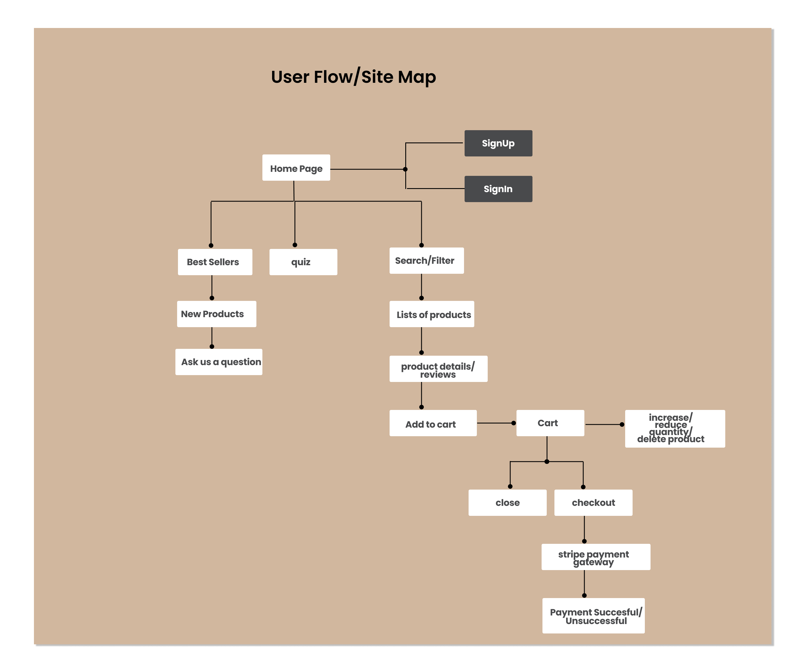

## Table of Contents
- [Problem Statement](#problem-statement)
- [Overview](#overview)
- [Key Pain Points](#key-pain-points)
- [Usage](#usage)
- [Features](#features)
- [Implementation](#implementation)
- [Tech Stack](#tech-stack)
- [APIs](#apis)
- [Sitemap](#sitemap)


### Project Title:  
Arewa


### Overview

Arewa is an e-commerce web app where users can find beauty products that suits their needs.
### Problem Statement 
Most beauty E-commerce websites provides a limited way to interact with the products (e.g., viewing only product information without customer reviews or ratings).
Complicated shopping experience that does not allow for easy addition, removal, and purchasing of products.

### Key Pain Points:  


### Usage  
 The goal is to develop a web app that:
1. Allows users to easily search for beauty products, filter results, and view product reviews and ratings.
2. Enables users to add/remove products from their cart and securely checkout.
3. Provides price comparison features and recommends similar products.


## Features 

- As a user i want   a beauty product website that has---search bar or filter
- As s user i  want to be able to read product views------product reviews/ratinsg.
- As a user i want to add product to cart and checkout or remove product------add item/delete item
- As a user i want to check Price Comparison  -----recommended product?


---

## Implementation 

### Tech Stack

- React
- JavaScript
- Express
- MySql


- Client Libraries:
    - react
    - react-router
    - axios
    - react-carousel

- Server Libraries:
    - express
    - knex
    - jwt
    - Cors
    - bcrypt
    - mysql2


---
### APIs

- No external APIs will be used i will develop my own API

---

### Sitemap



- Homepage
- Register/LogIn
- Product search &Filters
- Product Cart page
- Price Comparison
- Quiz page
- Add a review


## Data 

---

### Endpoints


**GET /bestSellers**

Response:
````
[
  {
    "id": 1,
    "name": "Orimore",
    "description":"bold lips shimmer lip gloss",
    "price":"$40.50"
    "ratings": "200"
  },
]

````
**GET /bestSellers/:id/reviews**

Response:
````
[
  {
    "id": 234,
    "name": "Mary Doe",
    "comment":"Best make up i ever purchased. Feels like it was made for my skin",
    "ratings": "5",
    "photo": "/image",
     "timestamp": 11724612264000,
  },
  {
    "id": 567,
    "name": "Jane Brown",
    "comment":"I can't even lie i love love this foundation it makes my make up so fleek and neat",
    "ratings": "5",
    "photo": "/image"
     "timestamp": 11724612055000,
  },
]

````
**POST /bestSellers/:id/reviews**

Post Body Example:
````
[
  {
    
    "name": "Mary Doe",
    "comment":"Best make up i ever purchased. Feels like it was made for my skin",
  },
  
]

Response:

[
  {
    
    "name": "Mary Doe",
    "comment":"Best make up i ever purchased. Feels like it was made for my skin",
    "ratings": "5",
    "photo": "/image",
     "timestamp": 11724612055000,
  },
  
]

````
**GET /trendy**

Response:
````
[
  {
    "id": 1,
    "photo": "/image",
   
  },
  {
    "id": 2,
    "photo": "/image",
   
  },
]

````


**GET /token**

  - backend token request set up for client side
  {
  "token": "eyJhbGciOiJ-SAMPLE-YmKdvciQST2VfjiUz4-M3Wl-T0kOg==",
  "type": "signUp"
}


  - Response for client side
  [
    {
      "token": "SAMPLE_jwt_token_here"
    }
  ]

---

**POST /users/signUp**

- Add a user account

Parameters:
- name: User's name
- email: User's email
- password: User's provided password

Response:
````
[
  {
    "token": "SAMPLE_signUp_jwt_token_here"
  },
]

````
**POST /users/SignIn**

- SignIn a user account

Parameters:

- email: User's email
- password: User's provided password

Response:
````
[
  {
    "token": "SAMPLE_signUp_jwt_token_here"
  },
]

````


### Roadmap

- Create client
   - react project with routes 
   - install all the necessary libraries

- Create server
  - express project with routing, with placeholder 200 responses

- Create migrations

- Create endpoints for bestsellers

- Create endpoints for trendy

- Create endpoints to implement LogIn jwt token

- Feature: HomePage
  - Card Carousel of 'best seller products
  - Create a GET request for best seller product details 

- Feature: product Details page
  - implement add to cart
  - implement brief product deatails
  - implement ingredient visible click button
  - implement view old reviews and add new  review gateway 

- Feature: Review Form Modal
  - implement a form where reviews, image can be added
  - Create a POST /bestsellers/:id/review of product directory

- Feature: view cart page
  - implement cart item increment and decrement
  - Implement checkout or continue shopping buttons

- Feature: stripe payment gateway connection
  - implement the final checkout link to stripe

- Feature: Profile Page
  - implement User profile page 
  - implement a GET request to backend for loggedin user
  - implement a log out button

